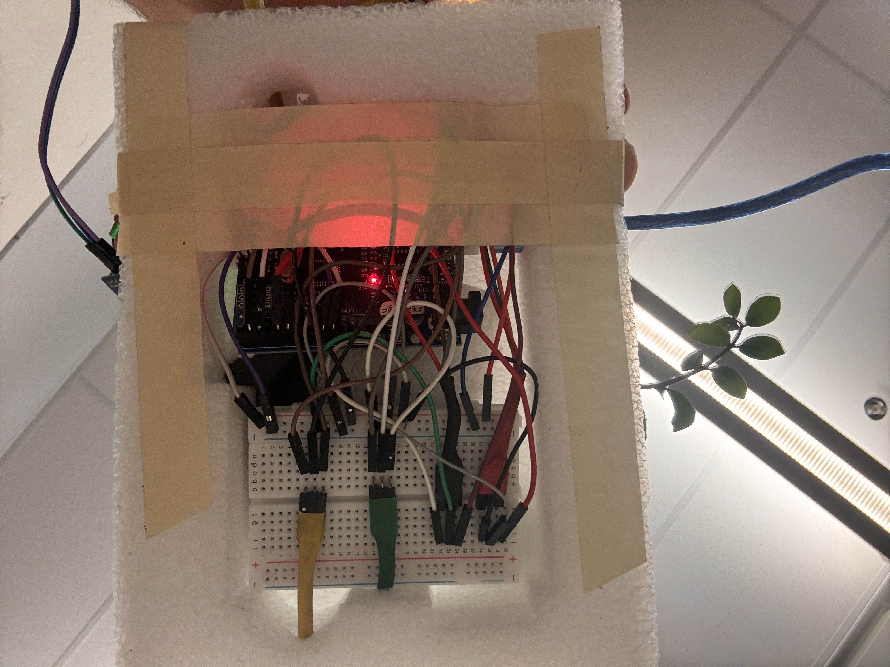

# SmartGarden Manager - PolyHacks 2025 Edition

A sustainable smart gardening solution that promotes biodiversity protection and optimized plant care through AI technology. Winner submission for PolyHacks 2025 in the "Sur la terre - Above ground" category.

## 🌱 Project Vision

SmartGarden Manager addresses critical environmental challenges while promoting sustainable gardening practices:

### Sustainability Pillars

#### 🌍 Environmental Impact

- Promotes native plant species preservation
- Reduces water waste through intelligent monitoring
- Supports biodiversity by helping users maintain healthy plants
- Optimizes resource usage through precise care recommendations
- Contributes to urban greening initiatives

#### 💰 Economic Viability

- Reduces plant replacement costs through better care
- Minimizes water and fertilizer waste
- Scalable SaaS business model
- Lower maintenance costs through preventive care
- Potential integration with smart home systems

#### 👥 Social Responsibility

- Educates users about sustainable gardening
- Creates community around plant care
- Makes gardening accessible to beginners
- Promotes environmental awareness
- Supports urban agriculture initiatives

### Category Alignment: "Sur la terre - Above ground"

Our project directly contributes to:

- **Protection des espèces en danger**: AI-powered plant identification helps protect and preserve endangered plant species
- **Agriculture de précision**: Smart monitoring optimizes resource usage and plant health
- **Sustainable Urban Development**: Promotes green spaces in urban environments

## Features

- 🌿 AI-powered plant identification and species preservation
- 🎯 Personalized, water-efficient care recommendations
- 📊 Real-time monitoring of environmental conditions
- 🔔 Smart notifications for optimal resource management
- 👥 User-specific plant collections and community features
- 📱 Accessible design for all user levels

## Technical Innovation

### Advanced Features

- Machine Learning plant identification using Google's Gemini AI
- Real-time environmental monitoring
- Automated care scheduling system
- Secure user data management with Row Level Security
- Progressive Web App capabilities

### Architecture

- **Frontend**: React + TypeScript + Vite
- **UI Components**: shadcn/ui
- **Styling**: Tailwind CSS
- **Backend**: Supabase (Auth, Database, Storage)
- **State Management**: TanStack Query
- **Routing**: React Router

## System Architecture

### 🔧 Hardware Module - Smart Garden Sensei

Our IoT solution integrates precision hardware components to monitor and optimize plant care:

#### Components

- Temperature & Humidity Sensor (DHT11)
- Soil Moisture Sensors
- Ambient Light Sensors
- Status LEDs
- Control Button
- Arduino-based Controller

#### Hardware Architecture

```
┌─────────────────┐      ┌──────────────────┐
│  Environmental  │      │    Control &      │
│    Sensors      │◄────►│    Processing    │
└─────────────────┘      └──────────────────┘
        ▲                         ▲
        │                         │
        ▼                         ▼
┌─────────────────┐      ┌──────────────────┐
│  User Interface │      │  Communication    │
│    (LED/BTN)    │◄────►│     Module       │
└─────────────────┘      └──────────────────┘
```

#### Key Controllers

1. **ButtonController**

   - Manages physical button interactions
   - Implements debouncing
   - Handles short/long press detection
   - Controls system power state

2. **LEDController**

   - Visual status indication
   - Green LED: Normal operation
   - Red LED: Critical conditions
   - Dynamic display based on sensor values

3. **SensorManager**

   - Temperature reading (DHT11)
   - Soil moisture monitoring
   - Ambient light measurement
   - Data validation and formatting

4. **SerialManager**

   - JSON-formatted data transmission
   - Value filtering
   - Debug logging capabilities

5. **SystemManager**
   - Component coordination
   - Sensor polling (30-second intervals)
   - Data transmission (2-minute intervals)
   - Threshold monitoring

#### Technical Specifications

- **Sampling Rate**: 30-second intervals
- **Data Transmission**: 2-minute intervals
- **Power Consumption**: Low-power design for sustainability
- **Communication**: Serial interface with JSON formatting
- **Error Handling**: Built-in data validation and error recovery

### Software Architecture

[Previous software architecture content remains the same...]

## Getting Started

### Prerequisites

- Node.js (v16+)
- npm or bun
- Supabase account
- Google Cloud account (for Gemini AI API)

### Installation

```bash
# Clone the repository
git clone <repository-url>

# Navigate to project directory
cd garden-sensei

# Install dependencies
npm install
# or
bun install

# Set up environment variables
cp .env.example .env
```

### Environment Setup

1. Create a new Supabase project
2. Copy your project URL and anon key from Supabase dashboard
3. Get a Gemini API key from Google Cloud Console
4. Update your `.env` file with the credentials

```
VITE_SUPABASE_URL=your_supabase_url
VITE_SUPABASE_ANON_KEY=your_supabase_anon_key
VITE_GEMINI_API_KEY=your_gemini_api_key
```

### Database Setup

1. Go to your Supabase project's SQL editor
2. Copy the contents of `setup_database.sql`
3. Run the SQL script to set up:
   - Tables (plants, profiles)
   - Row Level Security policies
   - Storage buckets
   - Authentication triggers

### Development

```bash
# Start the development server
npm run dev
# or
bun dev
```

Visit `http://localhost:5173` to see the app.

### Hardware Setup

1. **Components Required**

   ```
   - Arduino Uno/Nano
   - DHT11 Temperature Sensor
   - Soil Moisture Sensor
   - Light Dependent Resistor (LDR)
   - 2x LEDs (Green, Red)
   - Push Button
   - Resistors & Jumper Wires
   ```

2. **Assembly**

   - Connect sensors following the provided schematic
   - Upload the Arduino code from the hardware module
   - Verify LED indicators are functioning
   - Test button interface

3. **Configuration**
   - Set appropriate sensor thresholds
   - Configure sampling intervals
   - Calibrate moisture sensors
   - Test communication with main application

### Hardware Showcase

Below are images of our Smart Garden Sensei hardware module:

#### Complete Assembly


_The complete Smart Garden Sensei hardware module with all sensors connected._



### Key Features

#### Plant Identification

Upload a photo of your plant and let our AI identify it and provide care recommendations.

#### Plant Management

- Add and track multiple plants
- Monitor moisture, light, and temperature levels
- Get personalized care recommendations
- Set watering schedules

#### Security

- User authentication
- Row Level Security (RLS) ensures users can only access their own data
- Secure file storage for plant images

## Development Progress

### Current Implementation

- ✅ User authentication and profile management
- ✅ Plant identification system
- ✅ Care recommendations engine
- ✅ Environmental monitoring dashboard
- ✅ Notification system

### Planned Features

- 🔄 Community plant sharing platform
- 🔄 Endangered species database integration
- 🔄 IoT sensor integration
- 🔄 Water usage analytics
- 🔄 Seasonal care adjustments

## Hackathon Submission Details

### Project Category

**Sur la terre - Above ground**

- Focus on precision agriculture and species protection
- Emphasis on sustainable urban gardening
- Integration with environmental protection initiatives

### Technical Challenges Overcome

- Implementation of advanced AI for plant identification
- Real-time environmental data processing
- Secure multi-user data architecture
- Complex state management for live updates
- Progressive Web App optimization

### Sustainability Goals

- Reduce water consumption in urban gardening
- Protect and preserve plant species
- Optimize resource usage through smart monitoring
- Promote environmental education
- Support urban agriculture initiatives

## Troubleshooting

### Common Issues

1. **Database Connection Issues**

   - Check your Supabase credentials in `.env`
   - Ensure the database is properly initialized with `setup_database.sql`

2. **Image Upload Problems**

   - Verify storage bucket permissions
   - Check file size limits (max 5MB recommended)

3. **Authentication Errors**
   - Clear browser cache and local storage
   - Ensure email confirmation is completed

## Environmental Impact

### Hardware Sustainability

- Low-power components selection
- Sleep modes for energy conservation
- Modular design for easy repairs
- Recyclable materials usage
- Local manufacturing support

### Resource Optimization

- Precision watering based on real-time data
- Smart light exposure management
- Temperature-based care adjustments
- Preventive maintenance notifications
- Resource usage analytics

## License

This project is open-source and available under the MIT License.
